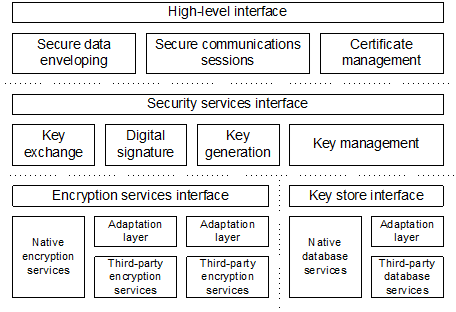
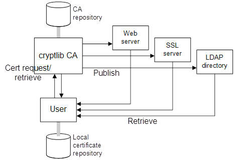
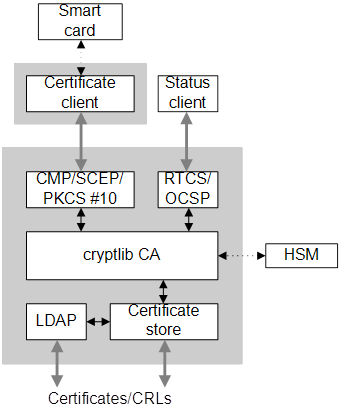

# cryptlib Security Toolkit

The information age has seen the development of electronic pathways that carry
vast amounts of valuable commercial, scientific, and educational information
between financial institutions, companies, individuals, and government
organisations.  Unfortunately the security systems required to protect data
are often extremely difficult to implement, and even when available tend to
require considerable understanding of the underlying principles in order to be
used.  The cryptlib security toolkit provides the answer to this problem.  A
complete description of the capabilities provided by cryptlib are given below.

## cryptlib Overview

cryptlib is a powerful security toolkit that allows even inexperienced crypto
programmers to easily add encryption and authentication services to their
software.  The high-level interface provides anyone with the ability to add
strong security capabilities to an application in as little as half an hour,
without needing to know any of the low-level details that make the encryption
or authentication work.  Because of this, cryptlib dramatically reduces the
cost involved in adding security to new or existing applications.

At the highest level, cryptlib provides implementations of complete security
services such as S/MIME and PGP/OpenPGP secure enveloping, SSL/TLS and SSH
secure sessions, CA services such as CMP, SCEP, RTCS, OCSP, and SCVP, and
other security operations such as secure timestamping (TSP).  Since cryptlib
uses industry-standard X.509, S/MIME, PGP/OpenPGP, and SSH/SSL/TLS data
formats, the resulting encrypted or signed data can be easily transported to
other systems and processed there, and cryptlib itself runs on virtually any
operating system — cryptlib doesn’t tie you to a single platform.  This allows
email, files, and EDI transactions to be authenticated with digital signatures
and encrypted in an industry-standard format.

cryptlib provides an extensive range of other capabilities including full
X.509/PKIX certificate handling (all X.509 versions from X.509v1 to X.509v3)
with additional support for Microsoft AuthentiCode, RPKI, SigG, S/MIME, SSL,
and Qualified certificates, PKCS #7 certificate chains, handling of
certification requests and CRLs including automated checking of certificates
against CRLs and online checking using RTCS, OCSP, and SCVP, and issuing and
revoking certificates using CMP and SCEP.  In addition cryptlib implements a
full range of certificate authority (CA) functions, as well as providing
complete CMP, SCEP, RTCS, OCSP, and SCVP server implementations to handle
online certificate enrolment/issue/revocation and certificate status checking.
Alongside the certificate handling, cryptlib provides a sophisticated key
storage interface that allows the use of a wide range of key database types
ranging from PKCS #11 devices, PKCS #15 key files, and PGP/OpenPGP key rings
through to commercial-grade RDBMS’ and LDAP directories with optional SSL
protection.

In addition to its built-in capabilities, cryptlib can make use of the crypto
capabilities of a variety of external crypto devices such as hardware crypto
accelerators, Fortezza cards, PKCS #11 devices, hardware security modules
(HSMs), and crypto smart cards.  For particularly demanding applications
cryptlib can be used with a variety of crypto devices that have received
appropriate FIPS 140 or ITSEC/Common Criteria certification.  The crypto
device interface also provides a convenient general-purpose plug-in capability
for adding new functionality that will be automatically used by cryptlib.
cryptlib also provides a general-purpose crypto HAL (hardware abstraction
layer) interface that allows it to use the native crypto capabilities
available in some ARM, MIPS, and PPC cores used in embedded systems and
devices.

cryptlib is supplied as source code for AMX, Arinc653, BeOS, ChorusOS, CMSIS-
RTOS, CMS, DOS, DOS32, eCOS, embOS, µC/OS, embedded Linux, FreeRTOS/OpenRTOS,
IBM MVS, µITRON, Mongoose OS, MQX, Nucleus, OS/2, OS X, OSEK, Quadros, RiotOS,
RTEMS, SMX, Tandem, Telit, ThreadX, T-Kernel, a variety of Unix versions
(including AIX, Digital Unix, DGUX, FreeBSD/NetBSD/OpenBSD, HP-UX, IRIX,
Linux, MP-RAS, OSF/1, QNX, SCO/UnixWare, Solaris, SunOS, Ultrix, and UTS4),
uClinux, VM/CMS, VxWorks, Windows (32- and 64-bit versions), Windows CE/
PocketPC/SmartPhone/Embedded, VDK, Xilinx XMK, and Zephyr.  cryptlib’s highly
portable nature means that it is also being used in a variety of custom
embedded system environments.  cryptlib comes with language bindings for C /
C++, C# / .NET, Delphi, Java, Perl, Python, and Visual Basic (VB).

## cryptlib features

cryptlib provides a standardised interface to a number of popular encryption
algorithms, as well as providing a high-level interface that hides most of the
implementation details and uses operating-system-independent encoding methods
that make it easy to transfer secured data from one operating environment to
another.  Although use of the high-level interface is recommended, experienced
programmers can directly access the lower-level encryption routines for
implementing custom encryption protocols or methods not directly provided by
cryptlib.

### Architecture

cryptlib consists of a set of layered security services and associated
programming interfaces that provide an integrated set of information and
communications security capabilities.  Much like the network reference model,
cryptlib contains a series of layers that provide each level of abstraction,
with higher layers building on the capabilities provided by the lower layers.

At the lowest level are basic components such as core encryption and
authentication routines, which are usually implemented in software but may
also be implemented in hardware (due to the speed of the software components
used in cryptlib, the software is usually faster than dedicated hardware).  At
the next level are components that wrap up the specialised and often quite
complex core components in a layer that provides abstract functionality and
ensures complete cross-platform portability of data.  These functions
typically cover areas such as “create a digital signature” or “exchange an
encryption key”.  At the highest level are extremely powerful and easy-to-use
functions such as “encrypt a message”, “sign a message”, “open a secure link”,
and “create a digital certificate” that require no knowledge of encryption
techniques, and that take care of complex issues such as key management, data
encoding, en/decryption, and digital signature processing.



cryptlib’s powerful object management interface provides the ability to add
encryption and authentication capabilities to an application without needing
to know all the low-level details that make the encryption or authentication
work.  The automatic object-management routines take care of encoding issues
and cross-platform portability problems, so that a handful of function calls
is all that’s needed to wrap up data in signed or encrypted form with all of
the associated information and parameters needed to recreate it on the other
side of a communications channel.  This provides a considerable advantage over
other encryption toolkits that often require hundreds of lines of code and the
manipulation of complex encryption data structures to perform the same task.

### S/MIME

cryptlib employs the IETF-standardised Cryptographic Message Syntax (CMS,
formerly called PKCS #7) format as its native data format. CMS is the
underlying format used in the S/MIME secure mail standard, as well as a number
of other standards covering secure EDI and related systems like HL7 medical
messaging and the Session Initiation Protocol (SIP) for services like Internet
telephony and instant messaging.

The S/MIME implementation uses cryptlib’s enveloping interface which allows
simple, rapid integration of strong encryption and authentication capabilities
into existing email agents and messaging software. The resulting signed
enveloped data format provides message integrity and origin authentication
services, the encrypted enveloped data format provides confidentiality, and
the authenticated encrypted data format provides all of these services at
once.  In addition cryptlib’s S/MIME implementation allows external services
such as trusted timestamping authorities (TSAs) to be used when a signed
message is created, providing externally-certified proof of the time of
message creation.  The complexity of the S/MIME format means that the few
other toolkits that are available require a high level of programmer knowledge
of S/MIME processing issues. In contrast cryptlib’s enveloping interface makes
the process as simple as pushing raw data into an envelope and popping the
processed data back out, a total of three function calls, plus one more call
to add the appropriate encryption or signature key.

### PGP/OpenPGP

Alongside the PKCS #7/CMS/SMIME formats, cryptlib supports the PGP/OpenPGP
message format, allowing it to be used to send and receive PGP-encrypted email
and data.  As with the S/MIME implementation, the PGP implementation uses
cryptlib’s enveloping interface to allow simple, rapid integration of strong
encryption and authentication capabilities into existing email agents and
messaging software.  Since the enveloping interface is universal, the process
involved in creating PGP and S/MIME messages is identical except for the
envelope format specifier, allowing a one-off development effort to handle any
secure message format.

### SSH and SSL/TLS

cryptlib supports secure network sessions using the SSH and SSL/TLS security
protocols.  As with envelopes, cryptlib takes care of the session details for
you so that all you need to do is provide basic communications information
such as the name of the server or host to connect to and any other information
required for the session such as a password or certificate.  cryptlib takes
care of establishing the session and managing the details of the
communications channel and its security parameters, and provides both client
and server implementations of all of these session types.

cryptlib also supports additional protocols in combination with the lower-
layer SSL/TLS secure tunnel.  These include the WebSockets protocol in client
and server implementations and various EAP / RADIUS-based protocols including
EAP-TLS, EAP-TTLS, and EAP-PEAP in client implementations.

### PKI Services: CMP, SCEP, RTCS, OCSP, SCVP, TSP

In addition to SSH and SSL/TLS, cryptlib also implements a full range of PKI
services in its secure session interface, again providing both client and
server implementations of all protocols.  These services include the
certificate management protocol (CMP), simple certificate enrolment protocol
(SCEP), real-time certificate status protocol (RTCS), online certificate
status protocol (OCSP), server-based certificate validation protocol (SCVP),
and timestamping (TSP).

By tying a key or certificate store to the session, you can let cryptlib take
care of any key management issues for you.  With a CMP or SCEP server session
cryptlib will use the certificate store to handle the certificate management
process.  In this way a complete CMP-based CA that handles enrolment,
certificate update and renewal, and certificate revocation, can be implemented
with only a handful of function calls.

### Plug-and-play PKI

Working with certificates can be complex and painful, requiring the use of a
number of arcane and difficult-to-use mechanisms to perform even the simplest
operations.  To eliminate this problem cryptlib provides a plug-and-play PKI
interface that manages all certificate processing and management operations
for you, requiring no special knowledge of certificate formats, protocols, or
operations.  Using the plug-and-play PKI interface with an appropriately-
configured CA means that cryptlib will automatically and transparently handle
key generation, certificate enrolment, securely obtaining trusted CA
certificates, and certifying the newly-generated keys for the user, all in a
single operation.  Similarly, certificate validity checking can be performed
using an online real-time status check that avoids the complexity and delayed
status information provided by mechanisms like CRLs.  The plug-and-play PKI
interface removes most of the complexity and difficulty involved in working
with certificates, making it easier to use certificates than with any of the
conventional certificate management mechanisms.

### Certificate Management

cryptlib implements full X.509 certificate support, including all X.509
version 3 extensions as well as extensions defined in the IETF PKIX
certificate profile. cryptlib also supports additional certificate types and
extensions including SET certificates, Microsoft AuthentiCode and Netscape and
Microsoft server-gated crypto certificates, Identrus certificates, qualified
certificates, resource PKI (RPKI) certificates, S/MIME and SSL client and
server certificates, SigG extensions, and various vendor-specific extensions
such as Netscape certificate types and the Thawte secure extranet.

In addition to certificate handling, cryptlib allows the generation of
certification requests suitable for submission to certification authorities
(CAs) in order to obtain a certificate.  Since cryptlib is itself capable of
processing certification requests into certificates, it is also possible to
use cryptlib to provide full CA services.  cryptlib also supports creating and
handling of certificate chains required for S/MIME, SSL/TLS, and other
applications, and the creation of certificate revocation lists (CRLs) with the
capability to check certificates against existing or new CRLs either
automatically or under programmer control.  In addition to CRL-based
revocation checking, cryptlib also supports online status protocols such as
RTCS, OCSP, and SCVP.  cryptlib also implements the CMP protocol which fully
automates the management of certificates, allowing online certificate
enrolment, issue, update/replacement, and revocation of certificates, and the
SCEP protocol, which automates the certificate issue process.  Using CMP
removes from the user any need for technical knowledge of certificate
management, since all details are managed by the CA.

cryptlib can import and export certification requests, certificates,
certificate chains, and CRLs, covering the majority of certificate transport
formats used by a wide variety of software such as web browsers and servers.
The certificate types that are supported include:

- Standard X.509 certificates
- AuthentiCode code signing certificates
- Certificates conformant to the IETF PKIX profile
- IPsec server, client, end-user, and tunnelling certificates
- Qualified certificates
- Resource PKI (RPKI) certificates
- SigG certificate extensions
- S/MIME email certificates
- SSL/TLS server and client certificates
- Timestamping certificates

In addition cryptlib supports X.509v3 IETF, S/MIME, SET, and SigG certificate
extensions and many vendor-specific extensions including ones covering public
and private key usage, certificate policies, path and name constraints, policy
constraints and mappings, and alternative names and other identifiers.  This
comprehensive coverage makes cryptlib a single solution for almost all
certificate processing requirements.

The diagram below shows a typical cryptlib application, in which it provides
the full functionality of both a CA (processing certification requests,
storing the issued certificates locally in a certificate database, and
optionally publishing the certificates on the web or in an LDAP directory) and
an end entity (generating certification requests, submitting them to a CA, and
retrieving the result from the web or a directory service).



To handle certificate trust and revocation issues, cryptlib includes a
certificate trust manager that can be used to automatically manage CA trust
settings.  For example a CA can be designated as a trusted issuer that will
allow cryptlib to automatically evaluate trust along certificate chains.
Similarly, cryptlib can automatically check certificates against RTCS, OCSP,
and SCVP responders and CRLs published by CAs, removing from the user the need
to perform complex manual checking.

### CA Operations

cryptlib includes a scalable, flexible Certificate Authority (CA) engine built
on the transaction-processing capabilities of a number of proven, industrial-
strength relational databases running on a variety of hardware platforms.  The
CA facility provides an automated means of handling certificate issuance
without dealing directly with the details of processing request, signing
certificates, saving the resulting certificates in keys stores, and assembling
CRLs.  This constitutes a complete CA system for issuance and management of
certificates and CRLs.  A typical cryptlib CA configuration is shown below.



Available CA operations include:

- Certificate enrolment/initialisation operations
- Certificate issue
- Certificate update/key update
- Certificate expiry management
- Revocation request processing
- CRL issue

All CA operations are recorded to an event log using cryptlib’s built-in CA
logging/auditing facility, which provides a comprehensive audit facility via a
full account of certificate requests, certificates issued or renewed,
revocations requested and issued, certificates expired, and general CA
management operations.  The logs can be queried for information on all events
or a specified subset of events, for example all certificates that were issued
on a certain day.

cryptlib contains a full implementation of a CMP server (to handle online
certificate management), and SCEP server (to handle online certificate issue),
a RTCS server (to handle real-time certificate status checking), and a OCSP
and SCVP servers (to handle revocation checking).  All of these servers are
fully automated, requiring little user intervention beyond the initial
enrolment process in which user eligibility for a certificate is established.
These services make it easier than ever to manage your own CA.  Certificate
expiration and revocation are handled automatically by the CA engine. Expired
certificates are removed from the certificate store, and CRLs are assembled
from previously processed certificate revocation requests.  These operations
are handled with a single function call, for example issuing a CRL is done
with:

  ```
  cryptCACertManagement( &cryptCRL, CRYPT_CERTACTION_ISSUE_CRL, cryptCertStore, CRYPT_UNUSED );
  ```

The CA keys can optionally be generated and held in tamper-resistant hardware
security modules, with certificate signing being performed by the hardware
module.  Issued certificates can be stored on smart cards or similar crypto
devices in addition to being managed using software-only implementations.  The
CA facility supports the simultaneous operation of multiple CAs, for example
to manage users served through divisional CAs certified by a root CA.  Each CA
can issue multiple certificates to users, allowing the use of separate keys
bound to signature and encryption certificates.

### Crypto Devices, Hardware, and Smart Card Support

In addition to its built-in capabilities, cryptlib can make use of the crypto
capabilities of external crypto devices and on-chip encryption accelerators,
crypto cores, and other hardware.  External device types supported include:

- Crypto smart cards
- Dallas iButtons
- Datakeys/iKeys
- Fortezza cards
- Hardware crypto accelerators
- Hardware security modules (HSMs)
- PCMCIA crypto tokens
- PCI crypto cards
- PKCS #11 devices
- USB tokens

Both these external devices and on-chip encryption hardware present in some
embedded processors and devices can be used by cryptlib to handle functions
such as key generation and storage, certificate creation, digital signatures,
and message en- and decryption.  Typical applications include:

- Running a certification authority inside tamper-resistant hardware
- Smart-card based digital signatures
- Message encryption/decryption in secure hardware

cryptlib manages any device-specific interfacing requirements so that the
programming interface for any crypto device is identical to cryptlib’s native
interface, allowing existing applications that use cryptlib to be easily and
transparently migrated to using crypto devices.  The ability to mix and match
crypto devices and the software-only implementation allows appropriate
tradeoffs to be chosen between flexibility, cost, and security.

### Certificate Store Interface

cryptlib utilizes commercial-strength RDBMS’ to store keys in the
internationally standardised X.509 format. The certificate store integrates
seamlessly into existing databases and can be managed using existing tools.
For example a key database stored on an MS SQL Server might be managed using
Visual Basic or MS Access; a key database stored on an Oracle server might be
managed through SQL*Plus.

In addition to standard certificate stores, cryptlib supports the storage and
retrieval of certificates in LDAP directories, HTTP access for keys accessible
via the web, and external flat-file key collections such as PKCS #15 soft-
tokens and PGP/OpenPGP key rings.  The key collections can be freely mixed (so
for example a private key could be stored in a PKCS #15 soft-token, a PGP/
OpenPGP key ring or on a smart card with the corresponding X.509 certificate
being stored in a certificate store, an LDAP directory, or on the web).

Private keys can be stored on disk encrypted with an algorithm such as AES
(selectable by the user), with the password processed using several thousand
iterations of a hashing algorithm like SHA-2 (also selectable by the user) and
the key data protected from tampering with an algorithm like HMAC-SHA2 (again
selectable by the user).  Where the operating system supports it, cryptlib
will apply system security features such as ACLs under Windows and file
permissions under Unix to the private key file to further restrict access.

### Security Features

cryptlib is built around a security kernel with Orange Book B3-level security
features to implement its security mechanisms.  This kernel provides the
interface between the outside world and the architecture’s objects (intra-
object security) and between the objects themselves (inter-object security).
The security kernel is the basis of the entire cryptlib architecture — all
objects are accessed and controlled through it, and all object attributes are
manipulated through it.  The kernel is implemented as an interface layer that
sits on top of the objects, monitoring all accesses and handling all
protection functions.

Each cryptlib object is contained entirely within the security perimeter, so
that data and control information can only flow in and out in a very tightly-
controlled manner, and objects are isolated from each other within the
perimeter by the security kernel.  For example once keying information has
been sent to an object, it can’t be retrieved by the user except under
tightly-controlled conditions.  In general keying information isn’t even
visible to the user, since it’s generated inside the object itself and never
leaves the security perimeter.  This design is ideally matched to hardware
implementations that perform strict red/black separation, since sensitive
information can never leave the hardware.

Associated with each object is a set of mandatory ACLs that determine who can
access a particular object and under which conditions the access is allowed.
If the operating system supports it, all sensitive information used will be
page-locked to ensure that it’s never swapped to disk from where it could be
recovered using a disk editor.  All memory corresponding to security-related
data is managed by cryptlib and will be automatically sanitised and freed when
cryptlib shuts down even if the calling program forgets to release the memory
itself.

Where the operating system supports it, cryptlib will apply operating system
security features to any objects that it creates or manages.  For example
under Windows cryptlib private key files will be created with an access
control list (ACL) that allows only the key owner access to the file; under
Unix the file permissions will be set to achieve the same result.

### Embedded Systems

cryptlib’s high level of portability and configurability makes it ideal for
use in embedded systems with limited resources or specialised requirements,
including ones based on Altera NIOS, ARM7, ARM9, ARM TDMI, Coldfire, Fujitsu
FR-V, Hitachi SuperH, MIPS IV, MIPS V, Motorola ColdFire, NEC V8xx series, NEC
VRxxxx series, Panasonic/Matsushita AM33/AM34, PowerPC, PowerQUICC, Risc-V,
Samsung CalmRISC, SH3, SH4, SPARC, SPARClite, StrongArm, TI OMAP, and Xilinx
MicroBlaze processors, as well as a large range of licensed derivatives of
these cores, too many and varied to enumerate here.  cryptlib doesn’t perform
any floating-point operations and runs directly on processors without an FPU,
and through its crypto HAL (hardware abstraction layer) capabilities can take
advantage of on-chip or in-system cryptographic hardware capabilities and
crypto cores where available, typically on some of the more advanced ARM, PPC,
and Risc-V cores.

The code is fully independent of any underlying storage or I/O mechanisms, and
works just as easily with abstractions like named memory segments in flash
memory as it does with standard key files on disk.  It has been deployed on
embedded systems without any conventional I/O capabilities (stdio) or dynamic
memory allocation facilities, with proprietary operating system architectures
and services including ATMs, printers, web-enabled devices, POS systems,
embedded device controllers, and similar environments, and even in devices
with no operating system at all (cryptlib runs on the bare metal).  It can
also run independent of any form of operating system, and has been run on the
bare metal in environments with minimal available resources, in effect
functioning as a complete crypto operating system for the underlying hardware.

Because cryptlib functions identically across all supported environments, it’s
possible to perform application development in a full-featured development
environment such as Windows or Unix and only when the application is complete
and tested move it to the embedded system.  This flexibility saves countless
hours of development time, greatly reducing the amount of time that needs to
be spent with embedded systems debuggers or in-circuit emulators since most of
the development and code testing can be done on the host system of choice.

If required the cryptlib developers can provide assistance in moving the code
to any new or unusual environments.

### Performance

cryptlib is re-entrant and completely thread-safe, allowing it to be used with
multithreaded applications under operating systems that support threads.
Because it is thread-safe, lengthy cryptlib operations can be run in the
background if required while other processing is performed in the foreground.
In addition cryptlib itself is multithreaded so that computationally intensive
internal operations take place in the background without impacting the
performance of the calling application.

Many of the core algorithms used in cryptlib have been implemented in assembly
language in order to provide the maximum possible performance, and will take
advantage of crypto hardware acceleration facilities present in some CPUs such
as the Via CPU family.  These routines provide an unprecedented level of
performance, in most cases running faster than expensive, specialised
encryption hardware designed to perform the same task.  This means that
cryptlib can be used for high-bandwidth applications such as video/audio
encryption and online network and disk encryption without the need to resort
to expensive, specialised encryption hardware.

### Programming Interface

cryptlib’s easy-to-use high-level routines allow for the exchange of encrypted
or signed messages or the establishment of secure communications channels with
a minimum of programming overhead.  Language bindings are available for C / C+
+, C# / .NET, Delphi, Java, Perl, Python and Visual Basic (VB).

cryptlib has been written to be as foolproof as possible.  On initialisation
it performs extensive self-testing against test data from encryption standards
documents, and the APIs check each parameter and function call for errors
before any actions are performed, with error reporting down to the level of
individual parameters.  In addition logical errors such as, for example, a key
exchange function being called in the wrong sequence, are checked for and
identified.

### Documentation

cryptlib comes with extensive documentation in the form of a 350-page
[user manual](https://github.com/cryptlib/cryptlib/blob/main/manual.pdf).
and a 320-page technical reference manual.  The user manual is intended for
everyday cryptlib use and contains detailed documentation on every aspect of
cryptlib’s functionality.  In most cases the code needed to secure an
application can be cut and pasted directly from the appropriate section of the
manual, avoiding the need to learn yet another programming API.

The technical reference manual covers the design and internals of cryptlib
itself, including the cryptlib security model and security mechanisms that
protect every part of cryptlib’s operation.  In addition the technical manual
provides a wealth of background information to help users understand the
security foundations on which cryptlib is built.

### Algorithm Support

Included as core cryptlib components are implementations of the most popular
encryption and authentication algorithms, AES, CAST, DES, triple DES, IDEA and
RC4, conventional encryption, SHA-1, and SHA-2/SHA-256 hash algorithms, HMAC-
SHA1, and HMAC-SHA2 MAC algorithms, and Diffie-Hellman, DSA, ECDSA, ECDH,
Elgamal, and RSA public-key encryption algorithms.  The algorithm parameters
are summarised below:

| Algorithm	| Key size | Block size |
| --- | --- | --- |
| AES | 128/192/256 | 128 |
| CAST-128 | 128 | 64 |
| ChaCha20 | 256 | 8 |
| DES | 56 | 64 |
| Triple DES | 112 / 168 | 64 |
| IDEA | 128 | 64 |
| RC4 | 2048 | 8 |
| | |
| SHA-1 | - | 160 |
| SHA-2 / SHA-256 | - | 256 |
| | |
| HMAC-SHA1 | 160 | 160 |
| HMAC-SHA2 | 256 | 256 |
| Poly1305 | 256 | 128 |
| | |
| Diffie-Hellman | 4096 | - |
| DSA | 4096 | - |
| ECDSA | 521 | - |
| ECDH | 521 | - |
| Elgamal | 4096 | - |
| RSA | 4096 | - |

Note that some of these algorithms are present only for backwards-
compatibility purposes or have security issues and shouldn’t be used unless
you know what you’re doing.  In particular DES and SHA-1 are no longer
regarded as secure, RC4 has serious security problems and shouldn’t be used,
and IDEA is only present for PGP 2.x compatibility which is slated for removal
in the next release.  In addition ECDSA and ECDH are extremely brittle
algorithms with the distressing habit of leaking the private key if anything
goes wrong, and need to be explicitly enabled when cryptlib is built in order
for them to be available.

### Standards Compliance

All algorithms, security methods, and data encoding systems in cryptlib either
comply with one or more national and international banking and security
standards or are implemented and tested to conform to a reference
implementation of a particular algorithm or security system.  Compliance with
national and international security standards is automatically provided when
cryptlib is integrated into an application.  These standards include ANSI
X3.92, ANSI X3.106, ANSI X9.9, ANSI X9.17, ANSI X9.30-1, ANSI X9.30-2, ANSI
X9.31-1, ANSI X9.42, ANSI X9.52, ANSI X9.55, ANSI X9.57, ANSI X9.62, ANSI
X9.63, ANSI X9.73, ANSI X9.95, ETSI TS 101 733, ETSI TS 101 861, ETSI TS 101
862, ETSI TS 102, ETSI TS 133 310 (3GPP CMP), FIPS PUB 46-2, FIPS PUB 46-3,
FIPS PUB 74, FIPS PUB 81, FIPS PUB 113, FIPS PUB 180, FIPS PUB 180-1, FIPS PUB
186, FIPS PUB 198, ISO/IEC 8372, ISO/IEC 8731 ISO/IEC 8732, ISO/IEC 8824/ITU-T
X.680, ISO/IEC 8825/ITU-T X.690, ISO/IEC 9797, ISO/IEC 10116, ISO/IEC 10118,
ISO/IEC 15782, ISO/IEC 18014, ITU-T X.842, ITU-T X.843, NSA Suite B, PKCS #1,
PKCS #3, PKCS #5, PKCS #7, PKCS #9, PKCS #10, PKCS #11, PKCS #15, RFC 1319,
RFC 1320, RFC 1321, RFC 1750, RFC 1991, RFC 2040, RFC 2104, RFC 2144, RFC
2202, RFC 2246, RFC 2268, RFC 2311 (cryptography-related portions), RFC 2312,
RFC 2313, RFC 2314, RFC 2315, RFC 2437, RFC 2440, RFC 2459, RFC 2510, RFC
2511, RFC 2528, RFC 2560, RFC 2585, RFC 2630, RFC 2631, RFC 2632, RFC 2633
(cryptography-related portions), RFC 2634, RFC 2785, RFC 2876, RFC 2898, RFC
2984, RFC 2985, RFC 2986, RFC 3039, RFC 3058, RFC 3114, RFC 3126, RFC 3161,
RFC 3174, RFC 3183, RFC 3211, RFC 3218, RFC 3261 (cryptography-related
portions), RFC 3268, RFC 3274, RFC 3278, RFC 3279, RFC 3280, RFC 3281, RFC
3369, RFC 3370, RFC 3447, RFC 3546, RFC 3526, RFC 3565, RFC 3739, RFC 3770,
RFC 3779, RFC 3851, RFC 3852, RFC 4055, RFC 4086, RFC 4108, RFC 4134, RFC
4210, RFC 4211, RFC 4231, RFC 4250, RFC 4251, RFC 4252, RFC 4253, RFC 4254,
RFC 4256, RFC 4262, RFC 4279, RFC 4325, RFC 4334, RFC 4346, RFC 4366, RFC
4387, RFC 4419, RFC 4476, RFC 4492, RFC 4648, RFC 4680, RFC 4681, RFC 4853,
RFC 4880, RFC 4945, RFC 5035, RFC 5055, RFC 5083, RFC 5246, RFC 5280, RFC
5288, RFC 5289, RFC 5430, RFC 5480, RFC 5652, RFC 5746, RFC 5750, RFC 5751,
RFC 5753, RFC 5754, RFC 5756, RFC 5758, RFC 5816, RFC 5911, RFC 5912, RFC
6211, RFC 7539, RFC 7905 and RFC 8439.  In addition cryptlib can be used as an
add-on security module to provide security services as per ISO/IEC 62351 for
SCADA protocols such as IEC 60870-5, DNP 3.0, IEC 60870-6 (TASE.2 or ICCP),
IEC 61850, and IEC 61334 (DLMS), and for the Payment Card Industry (PCI) Data
Security Standard (PCI-DSS).  Because of the use of internationally recognised
and standardised security algorithms, cryptlib users will avoid the problems
caused by home-grown, proprietary algorithms and security techniques that
often fail to provide any protection against attackers, resulting in
embarrassing bad publicity and expensive product recalls.

### Configuration Options

cryptlib works with a configuration database that can be used to tune its
operation for different environments.  This allows a system administrator to
set a consistent security policy which is then automatically applied by
cryptlib to operations such as key generation and data encryption and signing,
although they can be overridden on a per-application or per-user basis if
required.

### cryptlib Applications

The security services provided by cryptlib can be used in virtually any
situation that requires the protection or authentication of sensitive data.
Some areas in which cryptlib is currently used include:

- Protection of medical records transmitted over electronic links.
- Protection of financial information transmitted between branches of banks.
- Transparent disk encryption.
- Strong security services added to web browsers with weak, exportable security.
- Running a CA.
- Encrypted electronic mail.
- File encryption.
- Protecting content on Internet servers.
- Digitally signed electronic forms.
- S/MIME mail gateway.
- Secure database access.
- Protection of credit card information.

### Encryption Code Example

The best way to illustrate what cryptlib can do is with an example. The
following code encrypts a message using public-key encryption.

  ```
  /* Create an envelope for the message */
  cryptCreateEnvelope( &cryptEnvelope, cryptUser, CRYPT_FORMAT_SMIME );

  /* Push in the message recipient's name */
  cryptSetAttributeString( cryptEnvelope, CRYPT_ENVINFO_RECIPIENT, recipientName, recipientNameLength );

  /* Push in the message data and pop out the encrypted result */
  cryptPushData( cryptEnvelope, message, messageSize, &bytesIn );
  cryptFlushData( cryptEnvelope );
  cryptPopData( cryptEnvelope, encryptedMessage, encryptedSize, &bytesOut );

  /* Clean up */
  cryptDestroyEnvelope( cryptEnvelope );
  ```

This performs the same task as a program like PGP using just 6 function calls
(to create a PGP/OpenPGP message, just change the CRYPT_FORMAT_SMIME to
CRYPT_FORMAT_PGP).  All data management is handled automatically by cryptlib,
so there’s no need to worry about encryption modes and algorithms and key
lengths and key types and initialisation vectors and other details (although
cryptlib provides the ability to specify all this if you feel the need).  This
is all that’s required — just copy the above code into your application to S/
MIME-enable it.

The code shown above results in cryptlib performing the following actions:

- Generate a random session key for the default encryption algorithm (usually AES).
- Look up the recipient’s public key in a key database.
- Encrypt the session key using the recipient’s public key.
- Encrypt the signed data with the session key.
- Pass the result back to the user.

However unless you want to call cryptlib using the low-level interface, you
never need to know about any of this.  cryptlib will automatically know what
to do with the data based on the resources you add to the envelope — if you
add a signature key it will sign the data, if you add an encryption key it
will encrypt the data, and so on.

### Secure Session Code Example

Establishing a secure session using SSL/TLS is similarly easy:

  ```
  CRYPT_SESSION cryptSession;

  /* Create the session */
  cryptCreateSession( &cryptSession, cryptUser, CRYPT_SESSION_TLS );

  /* Add the server name and activate the session */
  cryptSetAttributeString( cryptSession, CRYPT_SESSINFO_SERVER_NAME, serverName, serverNameLength );
  cryptSetAttribute( cryptSession, CRYPT_SESSINFO_ACTIVE, 1 );
  ```

If you prefer SSH to SSL, just change the CRYPT_SESSION_TLS to CRYPT_-
SESSION_SSH and add a user name and password to log on.  As with the
encryption code example above, cryptlib provides a single unified interface to
its secure session mechanisms, so you don’t have to invest a lot of effort in
adding special-case handling for different security protocols and mechanisms.

The corresponding SSL/TLS (or SSH if you prefer) server is:

  ```
  CRYPT_SESSION cryptSession;

  /* Create the session */
  cryptCreateSession( &cryptSession, cryptUser, CRYPT_SESSION_TLS_SERVER );

  /* Add the server key/certificate and activate the session */
  cryptSetAttribute( cryptSession, CRYPT_SESSINFO_PRIVATEKEY, privateKey );
  cryptSetAttribute( cryptSession, CRYPT_SESSINFO_ACTIVE, 1 );
  ```

As with the secure enveloping example, cryptlib is performing a large amount
of work in the background, but again there’s no need to know about this since
it’s all taken care of automatically.

### Certificate Management Code Example

The following code illustrates cryptlib’s plug-and-play PKI interface:

  ```
  CRYPT_SESSION cryptSession;

  /* Create the CMP session and add the server name/address */
  cryptCreateSession( &cryptSession, cryptUser, CRYPT_SESSION_CMP );
  cryptSetAttributeString( cryptSession, CRYPT_SESSINFO_SERVER, server, serverLength );

  /* Add the username, password, and smart card */
  cryptSetAttributeString( cryptSession, CRYPT_SESSINFO_USERNAME, userName, userNameLength );
  cryptSetAttributeString( cryptSession, CRYPT_SESSINFO_PASSWORD, password, passwordLength );
  cryptSetAttribute( cryptSession, CRYPT_SESSINFO_CMP_PRIVKEYSET, cryptDevice );

  /* Activate the session */
  cryptSetAttribute( cryptSession, CRYPT_SESSINFO_ACTIVE, TRUE );
  ```

This code takes a smart card and generates separate encryption and signing
keys in it, requests a signature certificate from the CA for the signing key,
uses that to obtain a certificate for the encryption key, obtains any further
certificates that may be needed from the CA (for example for S/MIME signing or
SSL server operation), and stores everything in the smart card.  Compare this
to the hundreds or even thousands of lines of code required to do the same
thing using other toolkits.

Oh yes, and cryptlib provides the CA-side functionality as well — there’s no
need to pay an expensive commercial CA for your certificates, since cryptlib
can perform the same function.
